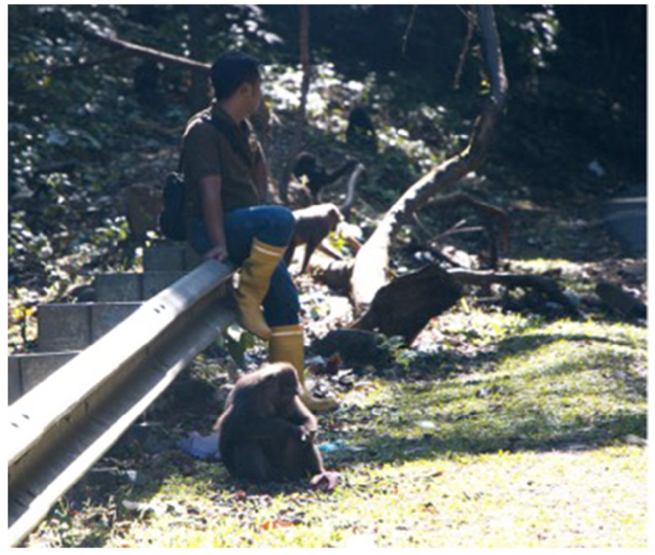
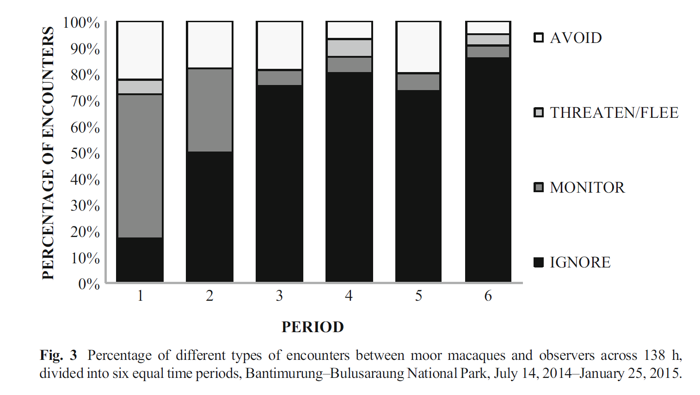

```{r setup, include=FALSE}
knitr::opts_chunk$set(echo = TRUE, warning = FALSE, comment = "##", prompt = TRUE, 
   tidy = TRUE, tidy.opts = list(width.cutoff = 75), fig.path = "img/")
```

## Background

In this study, *Beyond Neutrality: The Human-Primate Interface During the Habituation Process,* authors Hanson and Riley, along with field assistants, attempted to locate and observe two groups of **moor macaques** (*Macaca maura*) in **Sulawesi, Indonesia**. One of the groups, the **Group G** was already quite habituated and had been observed for several previous field seasons. **Group G** on the other hand, was not habituated. The goal of the paper was to compare the behaviors of both groups, to see if these changed over time, and to see if Group G began to show signs of "habituation" by the end of the field season, based on previous work by others regarding how we measure and conceive of habituation, especially in primate species. They also used ethnographic methods to discuss behavior and relationships between the macacques and the field assistants and other grad students who were there. For this replication assignment, we will focus on the behavioral data gathered, including length of encounter time. But the paper overall is a great read from the field of **ethnoprimatology!**



I was fortunate to connect with the lead author of this paper, K.T. Hanson, and she graciously gave me the original raw data that she was able to find. This was both a great advantage to using this article to replicate, but it also meant that I could only use what she was able to find to give me, which limited my ability to replicate some of the statistical analysis done in this paper. But, I was able to do enough for this assignment!

**Ok, let's get replicating!**

## Loading and Cleaning Data

First, I will load the {curl} package, to make loading in data much easier!

```{r}
library(curl)
```

Now to load my data from Group B:
```{r}
f <- curl("https://raw.githubusercontent.com/laurabw/laurabw-data-replication-assignment/master/Group%20B_ForLaura.csv")
Group_B <- read.csv(f, header = TRUE, sep = ",", stringsAsFactors = FALSE)
head(Group_B)
str(Group_B)
```

Ok, this data looks good! Again, this is exactly what I was given, so the columns are not optimally named, but it is something we can work with for this short assignment. If I was doing a longer project, I would want to clean this up as well.

We will be using the encounter duration times specifically, so let's just see what that looks like for *Group B*:

```{r}
Group_B$DURATION..MIN.
```

Great! Now let's do the same for Group G, and bring in the data:

```{r}
f <- curl("https://raw.githubusercontent.com/laurabw/laurabw-data-replication-assignment/master/GroupG_ForLaura.csv")
GroupG_ForLaura <- read.csv(f, header = TRUE, sep = ",", stringsAsFactors = FALSE)
head(GroupG_ForLaura)
```

In looking at the full data frame for Group G in another window on R Studio, I realized that there were several rows that had only NA for all answers, probably just empty rows that did not get cleaned up when the data was sent to me. So that we do not have to do deal with those let's clean up this data by removing all NAs from the data:

```{r}
Group_G <- na.omit(GroupG_ForLaura)
Group_G
head(Group_G)
Group_G$Duration.Min <- Group_G$`DURATION MIN`
```

Beautiful! Now let's see what just the encounter duration times look like for Group G:


```{r}
Group_G$Duration.Min
```

## Descriptive Stats:

Let's do some basic descriptive stats for these:

For Group B, let's find the mean encounter time:

```{r}
mean(Group_B$DURATION..MIN.)
```

Hmmmm, in the paper, it lists the mean encounter time for Group B as 180 min. I wonder if there were specific encounters they omitted that I am not seeing because I have the raw data? Let's see if Group G works better:

```{r}
mean(Group_G$Duration.Min)
```

Yes! This is the same as the paper, as they list the mean encounter time for Group G as 70 minutes.

## Inferential Statistics

One of the statistics they ran between Group B and Group G was a **Mann-Whitney U Test** or a two-sample Wilcoxon Test. This is a test for *nonparametric data* and allows for comparison of *two independent groups* when the *dependent variable is continuous or ordinal*. 

To do this, we simply use the wilcox.test() function. I also put in the argument for it to show us the confidence intervals. Furthermore, to test for the Z-score, you use the qnorm() function using the p-value from the test and dividing it by two. 

```{r}
Mann_Whitney_encounter <- wilcox.test(Group_B$DURATION..MIN.,Group_G$`DURATION MIN`, conf.int = TRUE, exact = 
FALSE)
Mann_Whitney_encounter
Z <- qnorm(Mann_Whitney_encounter$p.value/2) # This should give us the Z-score, in theory
Z
```

While this gives the correct p-value shown in the paper (p < 0.001), this does not give the same Z-score. I tried  a few different ways, but could not get the same result. 

In the paper, they split their data into 6 periods to make each period more easily able to be compared over time. I did make a data frame using this same split, but the paper did not then give how they compared these periods to discuss the overall time period. I tried using means from each time period and sums from each time period, but neither of these gave the correct p-value nor Z-score. 

This is one aspect the paper could have done more explcitly, by explaining how they compared overall variables for each group if they first split it into six periods.

The six periods did come in handy for the next part though, which was replicating a figure from the article.

# Replicating a figure from the article

Unfortunately, any of the inferential statistics I was able to replicate were not shown in a visual format in the paper. But, I was able to replicate the hsitogram below.

In order to replicate a figure from the article, I created another data frame that includes the 1-6 Periods the authors split the total encounter days into, the four main types of behaviors observed (**Avoid**, **Threaten/Flee**, **Monitor**, **Ignore**), and the percentage of time each of these behaviors were observed during each of the periods. 

This took awhile to figure out how to fit this all in to one data frame, but in the end, it worked out if period was just repeated four times for each behavior, knowing that when I made the historgram from the data frame using {ggplot2} and the (ggplot) function, it would know to group all of the behaviors in the same period together. 

```{r}
Group_G_Behavior <- data.frame(Period = c(1,1,1,1,2,2,2,2,3,3,3,3,4,4,4,4,5,5,5,5,6,6,6,6), Percentage_Time = c(20, 5, 57, 18, 18, 0, 32, 50, 18, 0, 5, 77, 7, 7, 7, 79, 20, 0, 5, 75, 4, 4, 4, 88), Behavior = c("Avoid", "Threaten/Flee", "Monitor", "Ignore","Avoid", "Threaten/Flee", "Monitor", "Ignore","Avoid", "Threaten/Flee", "Monitor", "Ignore","Avoid", "Threaten/Flee", "Monitor", "Ignore","Avoid", "Threaten/Flee", "Monitor", "Ignore","Avoid", "Threaten/Flee", "Monitor", "Ignore"))
Group_G_Behavior
```

Now that we have a data frame that should give us the results we want, I next had to figure out how to do a "stacked" histogram, with each bar being able to be split into the multiple behavior categories so that it would equal up to 100% while also showing the percentage for each behavior separately. I also had to adjust the levels of the behavior variables so they would stack in the same order as they do in the paper.

```{r}
library(ggplot2)
Behavior_Hist <- ggplot(data = Group_G_Behavior, aes(x = Period, y = Percentage_Time, fill = Behavior)) +   geom_bar(stat = "identity")
Behavior_Hist
Group_G_Behavior$Behavior <- factor(Group_G_Behavior$Behavior, levels = c ("Avoid", "Threaten/Flee", "Monitor", "Ignore")) #by changing these levels, I was able to have them in the same order they are in on the historgram in the article
Behavior_Hist <- ggplot(data = Group_G_Behavior, aes(x = Period, y = Percentage_Time, fill = Behavior)) + ylab("Percentage of Encounters") + geom_bar(stat = "identity")
Behavior_Hist # Updated the y-axis label to say "Percentage of Encounters" to match original figure in article
```

I think this looks nice and pretty similar to the image in the paper as far as overall asthetic (see below). The big difference is that mine is in color, though you could easily change this to another color theme, including a grayscale one that would print better in black and white.



